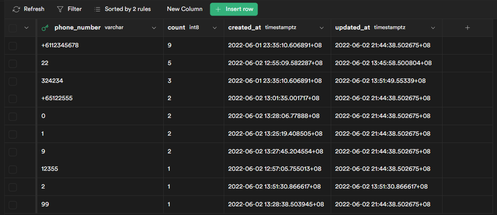
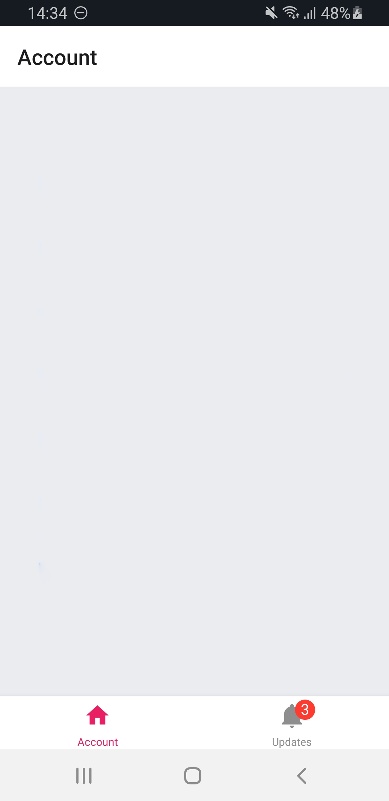
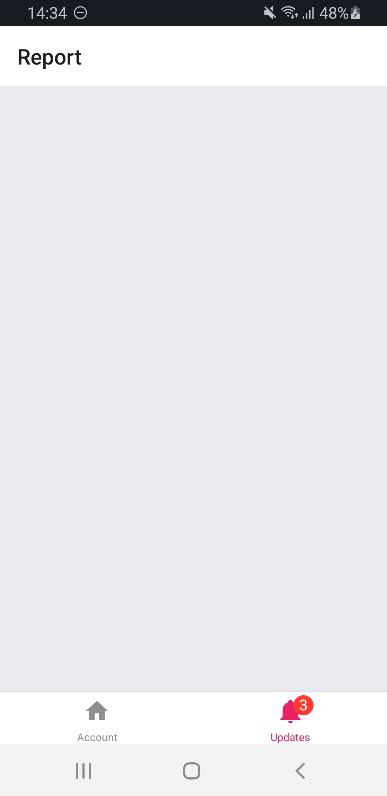
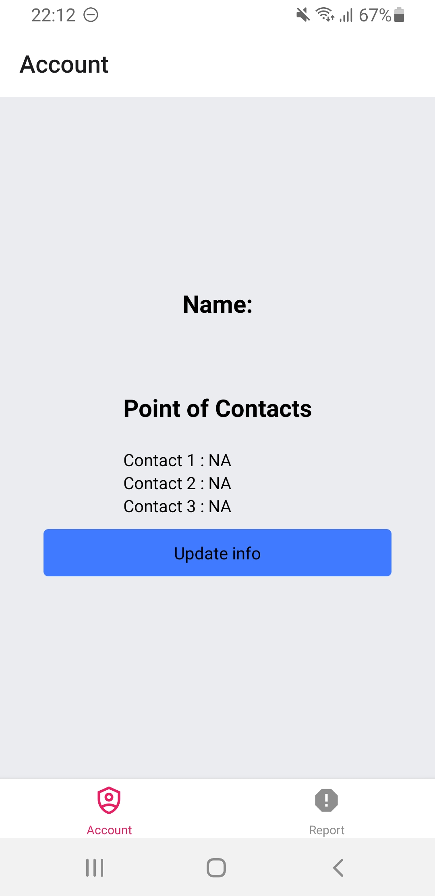
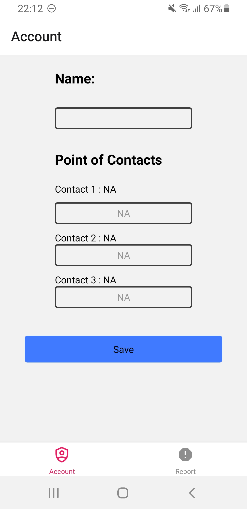

# Milestone 3

## Todos
  - prevent abuse of system through preventing users from sending repeated reports :gear:
    1. possibly using asyncstorage to store reports for a certain period of time before clearing
  - fixes on UI UX and other misc

---------------------------------------

# Milestone 2

## Restructuring of project
  - focus on project being a community effort to report scams
  - verification will be done in the backend so others may check any suspicious activity to determine if it is a scam
  - changed report and checks to EMAIL ADDRESSES, PHONE NUMBERS and LINKS
  - set up official database containing official contact information of important entities sourced from official sites such as government directories

## Todos
  - link report page to database for tracking of reported scam phone numbers :white_check_mark:
  - Edit `Updateinfo` page to autofill current information for easy edits :white_check_mark:
  - create a new interface for reporting of text, phone numbers and links :white_check_mark:
  - create new interface for validating legitimacy of email address, phone numbers and links :white_check_mark:
  - prevent abuse of system through preventing users from sending repeated reports
    1. possibly using asyncstorage to store reports for a certain period of time before clearing

## Progress Updates
2 June
- Linked report page to supabase
 
 
3 June
- integrated pre filled text for text inputs in update page
- Issues with this feature to be resolved
   1. Unable to delete records

9 June
- created database for links and text reports
- create a new interface for reporting of text, phone numbers and links
- added a new navigation tab for validating legitamacy of various channels
- create new interface for validating legitimacy of text, phone numbers and links

10 June
- created checker page
- created link checker
- created phone number checker

11 June
- created text and sms checker

---------------------------------------

# To do for milestone 1 (by 30th May):
- Identify the features for the system
  1. screen incoming phone numbers from texts and calls
- Design the system
- Create a development plan
- Pick up the necessary technologies
  1. react native
  2. supabase / firebase
- Build a technical proof of concept (e.g., an integrated frontend + backend with the login/register feature)
- Document the project

# Next Steps
  - set up bottom navigation tab :white_check_mark:
  - set up `Account page` :white_check_mark:
  - set up registering of name and NOK contact number :white_check_mark:
  - set up `updateinfo` page :white_check_mark:
  - Use redux persist or asyncstorage to store the data locally between app executions (close, open, restart phone, etc). :white_check_mark:
  - set up report page :white_check_mark:
  - Edit `Updateinfo` page to autofill current information for easy edits :gear:
  - Use sms OTP to verify NOK contact number
  - link report page to database for tracking of reported scam phone numbers
  - Backend for screening of incoming phone number and text messages
  - sms alerts

# Progress Updates
23 May
- Created bottom tab navigation for `Account` and `Report`.

| Account tab | Report tab   |
|-------------|--------------|
|  |  |

24 May
- Added in Redux to display user's name and NOK contact details
- Added updateinfo.js to facilitate registering and update of name and NOK contact details using redux.
- Edited Account screen to show information in real time and added a button to navigate to the update page.

   
 <video src= "https://user-images.githubusercontent.com/84615041/170058063-7e67323f-7b13-42e3-8193-2051e2f7bf84.mp4" width = '150px' height ='300px'>

25 May
  - tried to integrate redux persist to store data but failed :sob:
  
26 May
- Integrated asyncstorage
- Name and NOK phone numbers will be stored locally and can be retrieved and updated even after closing and restarting the app.
- Prevents PDPA concerns of storing sensitive personal information in our database to better protect users from vulnerabilities in databases.
  
